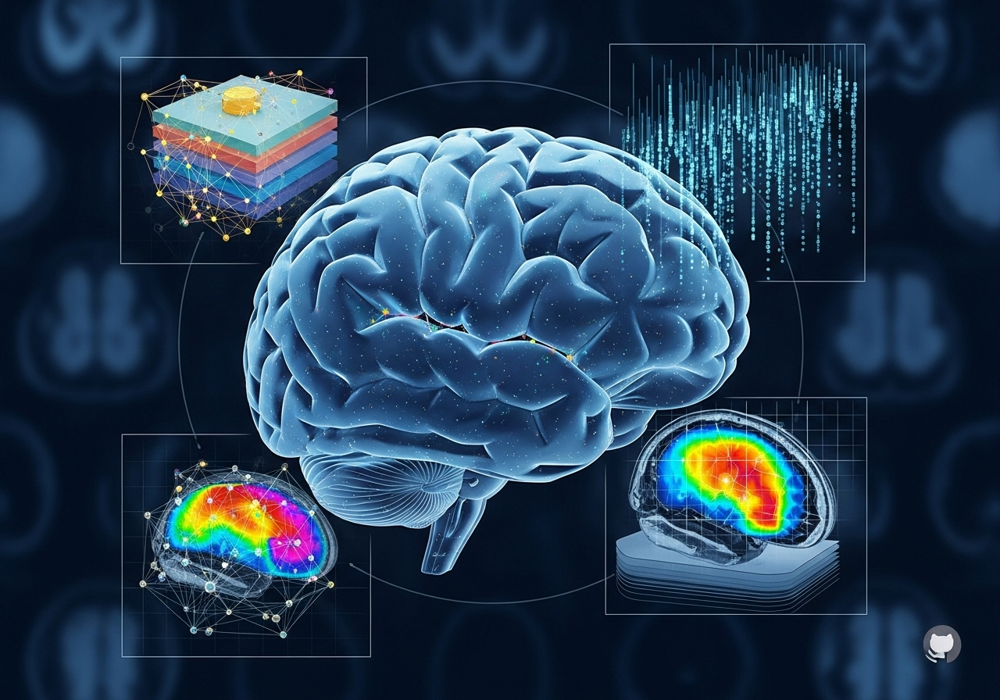
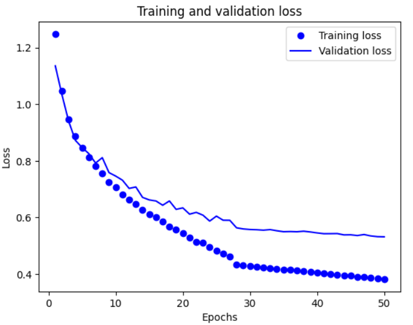
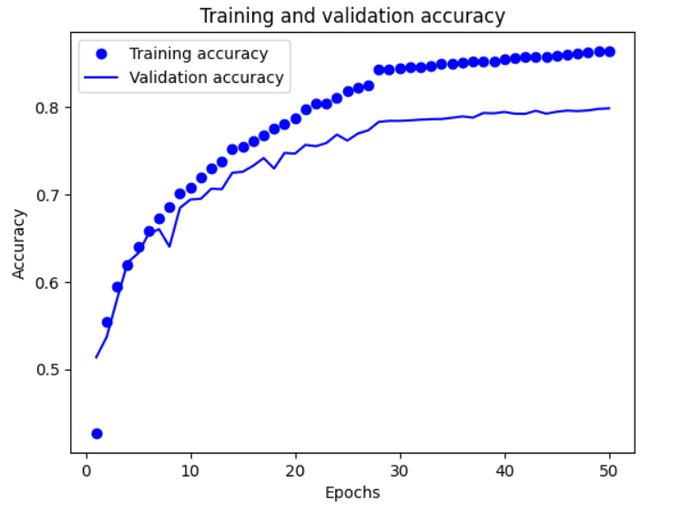
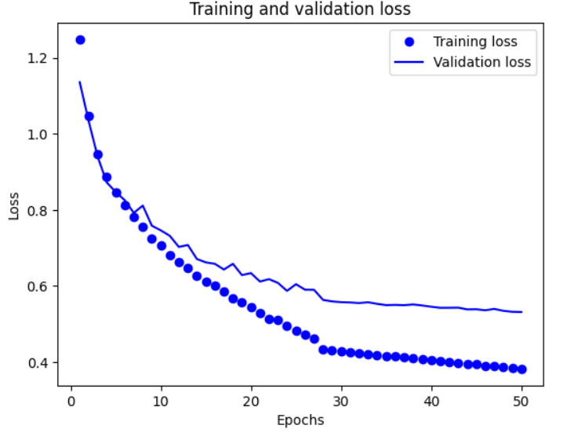
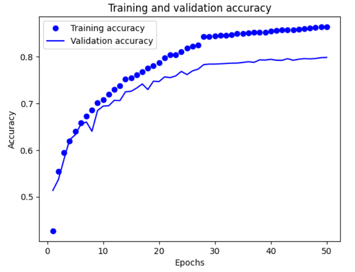
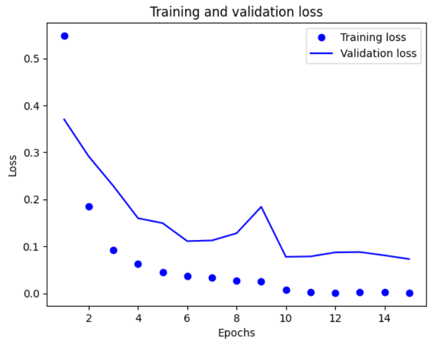
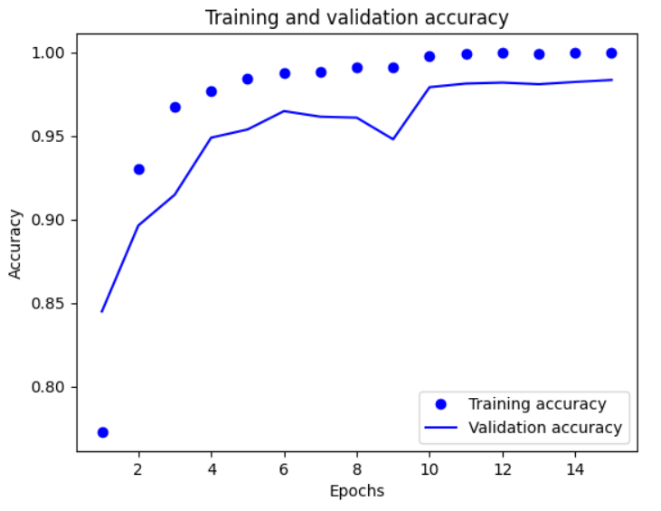
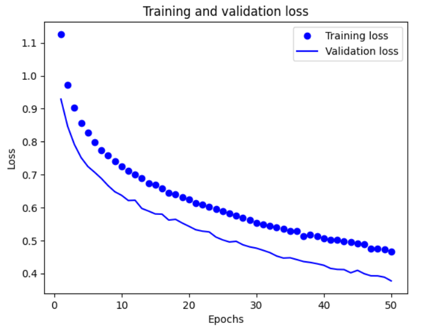
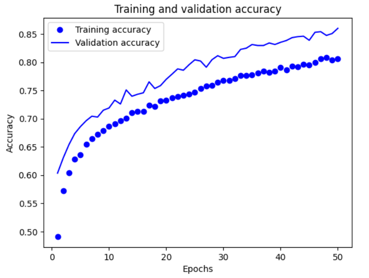

# Alzheimer's Disease Classification from MRI Scans



This repository contains a Jupyter Notebook that explores various deep learning models for classifying the stages of Alzheimer's Disease using MRI scan images. The project demonstrates an iterative approach, starting from a simple CNN and progressing to fine-tuned, state-of-the-art transfer learning models to achieve high classification accuracy.

[](https://www.python.org/downloads/release/python-3110/)
[](https://www.tensorflow.org/)
[](https://keras.io/)

---

## Table of Contents
- [Project Overview](#project-overview)
- [Dataset](#dataset)
- [Models Explored](#models-explored)
- [Results](#results)
- [Demo](#demo)
- [Installation & Usage](#installation--usage)
- [Download the Models](#download-models)
- [File Structure](#file-structure)
- [Contributing](#contributing)

## Project Overview

Alzheimer's disease is a progressive neurodegenerative disorder that is the most common cause of dementia. Early and accurate diagnosis is crucial for patient care and management. This project leverages computer vision and deep learning to classify brain MRI images into four distinct stages of the disease:

1.  **Non-Demented**
2.  **Very Mild Demented**
3.  **Mild Demented**
4.  **Moderate Demented**

The notebook systematically builds, trains, and evaluates several Convolutional Neural Network (CNN) architectures to find the most effective model for this classification task.

## Dataset

The project utilizes the **Alzheimer's Disease Dataset (V2)** available on Kaggle. This dataset contains thousands of MRI images (already augmented), pre-sorted into the four classes mentioned above.

- **Source:** [Kaggle - Alzheimer's Disease Dataset](https://www.kaggle.com/datasets/ashrafulhossenakash/alzheimer-disease-dataset)
- **Data Split:** The data is organized into `train`, `val`, and `test` directories.
  - **Training set:** 23,788 images
  - **Validation set:** 5,097 images
  - **Test set:** 5,099 images
- **Image Preprocessing:** All images are resized to `180x180` pixels and pixel values are normalized to the `[0, 1]` range.

## Models Explored

Several models were implemented to compare their performance on this task. Each model builds upon the previous one in complexity and performance.

1.  **Simple CNN:**
    - A baseline CNN built from scratch with three convolutional layers (`32`, `64`, `128` filters) followed by MaxPooling layers.
    - Serves as an initial benchmark to test the feasibility of the task.
  
    
    

2.  **Deeper CNN:**
    - An enhanced version of the simple CNN with more convolutional layers and a denser classification head.
  
    
    
    
3.  **Deeper CNN with Regularization:**
    - Incorporates **Batch Normalization** after each convolution to stabilize training and **Dropout** to prevent overfitting.

4.  **Transfer Learning with Xception (Feature Extraction & Fine-Tuning):**
    - Utilizes the powerful **Xception** architecture pre-trained on ImageNet.
    - **Feature Extraction:** The convolutional base is frozen, and a custom classification head is trained on top.
    - **Fine-Tuning:** The top layers of the Xception base are unfrozen and trained with a very low learning rate to adapt the learned features to the MRI dataset.
  
    
    

5.  **Transfer Learning with EfficientNetV2S (Feature Extraction & Fine-Tuning):**
    - Implements a similar transfer learning pipeline using the **EfficientNetV2S** model, known for its balance of performance and computational efficiency.
    - The same two-stage process of feature extraction followed by fine-tuning is applied.
  
    
    

## Results

The performance of each model was evaluated on the unseen test set. The results clearly show the superiority of fine-tuned transfer learning models for this task.

| Model                                      | Test Accuracy |
| ------------------------------------------ | :-----------: |
| Simple CNN                                 |    79.6%      |
| Deeper CNN                                 |    87.8%      |
| Deeper CNN with Regularization             |    93.0%      |
| Xception (Feature Extraction only)         |    86.3%      |
| **Xception (Fine-Tuned)**                  |  **97.8%**    |
| EfficientNetV2S (Feature Extraction only)  |    85.9%      |
| **EfficientNetV2S (Fine-Tuned)**           |  **98.6%**    |

The fine-tuned Xception and EfficientNetV2S models both achieved an outstanding test accuracy, demonstrating their effectiveness in medical image classification. It is important to note that both models still have room for improvement by increasing the number of epochs and progressively decreasing the learning rate, which could enable them to achieve an accuracy of over 99%.

## Demo


Try it out!

[](https://tdimeo-alzheimer-image-classifier.hf.space)

## Installation & Usage

To replicate this project, follow the steps below.

1.  **Clone the repository:**
    ```bash
    git clone https://github.com/tomasdimeo/alzheimer-disease-cnn-image-classifier.git
    cd alzheimer-disease-cnn-image-classifier
    ```

2.  **Install dependencies:**
    It is recommended to use a virtual environment.
    ```bash
    pip install -r requirements.txt
    ```

3.  **Download the Dataset:**
    - Download the dataset from [Kaggle](https://www.kaggle.com/datasets/vbookshelf/alzheimer-disease-dataset-v2).
    - Unzip the file and place the `Alzheimer_Dataset_V2` folder in your project directory. Update the path in the notebook if necessary.

4.  **Run the Jupyter Notebook:**
    Launch Jupyter and open the `alzheimer-disease-image-classifier.ipynb` notebook to run the cells. The notebook is configured to save the best model weights for each architecture.

## Download the models

Efficient Net V2S Fine-Tuned

```
from huggingface_hub import from_pretrained_keras

model = from_pretrained_keras("tdimeo/efficientnetv2s-fine-tuned.keras")
```

Xception Fine-Tuned

```
from huggingface_hub import from_pretrained_keras

model = from_pretrained_keras("tdimeo/xception-fine-tuned")
```

## File Structure

.
├── alzheimer-disease-image-classifier.ipynb # The main Jupyter Notebook with all experiments
├── images # Images
├── demo # Demo
├── LICENCE # Licence
└── README.md # You are here

## Contributing
Contributions are welcome! If you have any suggestions for improvement, feel free to create a pull request or open an issue.
